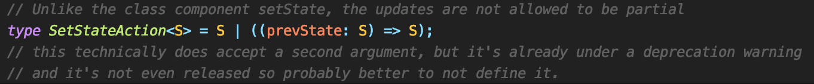

### 프로퍼티(props)와 상태(state)의 개념

컴포넌트 트리에서 모든 속성은 프로퍼티(props)와 상태(state)로 나뉜다. 상호작용이 필요한 경우에는 상태로 관리하고, 그 외에는 프로퍼티 형식으로 전달한다.

### 상태를 업데이트하는 방법

리액트에서 상태를 업데이트 할때 setState함수를 호출한다. setState는 업데이트 할 부분을 포함하는 객체를 인자로 받고 state에 merge하는 방식으로 상태를 업데이트 한다.

#### 다음 예시를 보자

```tsx
import { useState } from 'react';

const App = () => {
  const [state, setState] = useState<number>(3);
  const add = () => setState(state + 1);
  const multiply = () => setState(state * 2);
  const multiplyAndAdd = () => {
    multiply();
    add();
  };
  return (
    <div>
      <div>{state}</div>
      <button onClick={add}>Add</button>
      <button onClick={multiply}>Multiply</button>
      <button onClick={multiplyAndAdd}>MultiplyAndAdd</button>
    </div>
  );
};
```

1.  Add button Click : 4
2.  Multiply button Click : 6
3.  MultiplyAndAdd button Click : 4

setState를 연속적으로 사용하면 마지막 setState만 실행되는 것 처럼 보인다.

### setState의 특성

1.  setState는 비동기적으로 처리된다
2.  setState를 연속적으로 호출하면 Batch처리를 한다

setState가 호출되면 리액트는 전달받은 state로 값을 바꾸는 것이 아닌 이전의 리액트 엘리먼트의 state와 전달받은 state를 비교하는 작업을 거치고, 최종적으로 변경된 부분만 DOM에 적용한다.
그래서 리액트는 setState가 연속적으로 호출되면 state를 합치는 merge작업을 수행한 뒤에 한번의 setState만 처리한다

```tsx
  const newState = Object.assign({ number: 6 }, { number: 4 });
```

Object.assign과 같이 여러 개의 객체를 합칠 때 같은 key를 가지고 있다면 하나의 key: value쌍만 적용되기 때문에 마지막 object인 number: 4만 적용된다.

### 그렇다면 우리가 원하는 값인 3*2+1 =7의 결과를 얻기 위해선 어떻게 해야할까?



리액트의 setState는 인자로 두 가지 타입을 받는다

1.  새로운 state
2.  prevState 객체를 인자를 받아 새로운 state를 반환하는 콜백함수

### 함수형setState

setState가 비동기적으로 동작함은 변함없지만 인자로 받은 함수들은 queue에 저장되어 순서대로 실행된다.
리액트는 queue의 각 함수를 호출하여 상태를 업데이트하고 이전 상태, 즉 함수형 setState 호출 이전 상태를 전달한다. 만약 함수형 setState 호출이 아니라면, 큐 내의 이전의 setState 호출로부터 갱신된 상태를 전달한다.

#### 함수형 setState의 특성을 이용해 소스를 수정해보자

```tsx
import { useState } from 'react';

const App = () => {
  const [state, setState] = useState<number>(3);
  const add = () => setState(state => state + 1);
  const multiply = () => setState(state => state * 2);
  const multiplyAndAdd = () => {
    multiply();
    add();
  };
  return (
    <div>
      <div>{state}</div>
      <button onClick={add}>Add</button>
      <button onClick={multiply}>Multiply</button>
      <button onClick={multiplyAndAdd}>MultiplyAndAdd</button>
    </div>
  );
};
```

1.  Add button Click : 4
2.  Multiply button Click : 6
3.  MultiplyAndAdd button Click : 7

### 결론
리액트에서 가장 자주 사용하는 setState이지만 어떻게 사용하느냐에 따라 다른 결과를 도출할 수 있다. setState를 사용할 때 한번 더 생각하고 정확한 로직을 구현하기 위해 생각하는 습관을 가저야 한다.
